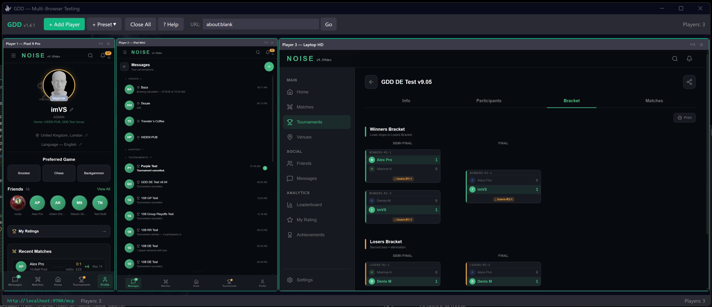

<p align="center">
  
</p>

<h1 align="center">GDD — Giggly-Dazzling-Duckling</h1>

<p align="center">
  <strong>AI-controlled browser farm on your machine</strong><br>
  Simulate multiple real users across 22 device types — test your site like it's launch day.
</p>

<p align="center">
  <a href="https://github.com/Cap-of-tea/GDD/releases/latest"></a>
  
  <a href="https://modelcontextprotocol.io/"></a>
  <a href="https://registry.modelcontextprotocol.io"></a>
  <a href="LICENSE"></a>
</p>
<p align="center">
  
  
</p>

---

## How It Works

> **You:** Open 3 iPhones and a desktop, navigate to myapp.com, test the signup form on all devices
>
> **Claude Code** creates 4 browsers with device emulation, navigates each to your app, fills in the form, takes screenshots, checks console for errors — all in parallel.

```text
gdd_add_players(3, device="iPhone 15 Pro")    → players [1, 2, 3]
gdd_add_players(1, device="Desktop 1080p")    → player  [4]
gdd_navigate(1, "https://myapp.com")          → all 4 browsers open your app
gdd_tap(1, "#signup-btn")                     → taps signup on iPhone
gdd_screenshot(1)                             → captures the result
gdd_get_console(1, level="error")             → checks for JS errors
```

GDD runs N isolated Chromium instances, each with its own profile, cookies, device emulation, geolocation, and network conditions. It exposes **37 MCP tools** via HTTP on `localhost:9700`.

<p align="center">
  
</p>

---

## Install

GDD comes in two flavours. The **Server** is headless — it's just the MCP backend, runs anywhere (including boxes with no display), and is all you need for pure AI automation. The **Desktop app** adds a GUI: a live grid of browser thumbnails you can click into to take over a session by hand. The Server runs on port `9700`, the Desktop app on `9800` — so you can run both side by side.

**Server (headless)** — the MCP backend:

| Platform | Download | Run |
|----------|----------|-----|
| **Linux** | [GDD-Server-Linux.tar.gz](https://github.com/Cap-of-tea/GDD/releases/latest/download/GDD-Server-Linux.tar.gz) | `chmod +x GDD.Headless && ./GDD.Headless` |
| **macOS ARM** | [GDD-Server-macOS-ARM.tar.gz](https://github.com/Cap-of-tea/GDD/releases/latest/download/GDD-Server-macOS-ARM.tar.gz) | `bash Scripts/setup-macos.sh && ./GDD.Headless` |
| **macOS Intel** | [GDD-Server-macOS-Intel.tar.gz](https://github.com/Cap-of-tea/GDD/releases/latest/download/GDD-Server-macOS-Intel.tar.gz) | `bash Scripts/setup-macos.sh && ./GDD.Headless` |
| **Windows** | [GDD-Server-Windows.zip](https://github.com/Cap-of-tea/GDD/releases/latest/download/GDD-Server-Windows.zip) | `.\GDD.Headless.exe` |
| **Docker** | `ghcr.io/cap-of-tea/gdd` | `docker run -p 9700:9700 ghcr.io/cap-of-tea/gdd` |
| **Claude Desktop** | [Win](https://github.com/Cap-of-tea/GDD/releases/latest/download/GDD-Server-Windows.mcpb) / [Mac ARM](https://github.com/Cap-of-tea/GDD/releases/latest/download/GDD-Server-macOS-ARM.mcpb) / [Mac Intel](https://github.com/Cap-of-tea/GDD/releases/latest/download/GDD-Server-macOS-Intel.mcpb) (.mcpb) | Open `.mcpb` file — installs as desktop extension |

**Desktop app (GUI)** — a live grid of browser thumbnails you can click into:

| Platform | Download | Run |
|----------|----------|-----|
| **Windows** | [GDD-Desktop-Windows.zip](https://github.com/Cap-of-tea/GDD/releases/latest/download/GDD-Desktop-Windows.zip) | Extract, run `GDD.exe` ([WebView2](https://developer.microsoft.com/en-us/microsoft-edge/webview2/) required) |
| **Linux** | [GDD-Desktop-Linux.tar.gz](https://github.com/Cap-of-tea/GDD/releases/latest/download/GDD-Desktop-Linux.tar.gz) | `bash Scripts/install-deps.sh && ./GDD.Desktop` |
| **macOS ARM** | [GDD-Desktop-macOS-ARM.tar.gz](https://github.com/Cap-of-tea/GDD/releases/latest/download/GDD-Desktop-macOS-ARM.tar.gz) | `bash Scripts/setup-macos.sh && ./GDD.Desktop` |
| **macOS Intel** | [GDD-Desktop-macOS-Intel.tar.gz](https://github.com/Cap-of-tea/GDD/releases/latest/download/GDD-Desktop-macOS-Intel.tar.gz) | `bash Scripts/setup-macos.sh && ./GDD.Desktop` |

The Windows app uses WebView2; the Linux/macOS app (built with Avalonia) drives real Chromium windows parked off-screen. Self-contained binary, ~70 MB. No .NET installation needed. Chromium downloads automatically on first launch.

**One-liner (Linux):**

```bash
curl -sL https://github.com/Cap-of-tea/GDD/releases/latest/download/GDD-Server-Linux.tar.gz | tar xz && chmod +x GDD.Headless && ./GDD.Headless
```

<details>
<summary><strong>Docker</strong></summary>

```bash
# Run (headless, port 9700)
docker run -p 9700:9700 ghcr.io/cap-of-tea/gdd

# Or build locally
docker build -t gdd .
docker run -p 9700:9700 gdd
```

The Docker image runs in headless mode with all Chromium dependencies pre-installed.

</details>

By default, browsers launch in **headed** mode (visible windows). Add `--headless` for CI/CD.

---

## Connect to Your AI Client

Add to `.mcp.json` and restart your AI client:

```json
{
  "mcpServers": {
    "gdd": {
      "url": "http://localhost:9700/mcp"
    }
  }
}
```

That's it. Start GDD, tell Claude or Cursor to test your app.

> **Claude Desktop users:** Download the `.mcpb` file from [Releases](https://github.com/Cap-of-tea/GDD/releases/latest) and open it — GDD installs as a one-click desktop extension. No manual config needed.

<details>
<summary><strong>Config file locations</strong></summary>

| Client | Project config | Global config |
| ------ | -------------- | ------------- |
| Claude Code | `<project>/.mcp.json` | `~/.claude/.mcp.json` |
| Cursor | `<project>/.cursor/mcp.json` | `~/.cursor/mcp.json` |
| VS Code / Windsurf / Antigravity | `<project>/.vscode/mcp.json` | IDE `settings.json` |

Global and project configs are merged — servers from both are available simultaneously. Changes are picked up only when restarting the AI client session.

</details>

<details>
<summary><strong>VS Code-based IDEs (Windsurf, Antigravity, Copilot)</strong></summary>

VS Code-based IDEs use a different config format than Claude Code / Cursor.

**Project config** — `.vscode/mcp.json`:

```json
{
  "servers": {
    "gdd": {
      "type": "http",
      "url": "http://localhost:9700/mcp"
    }
  }
}
```

**Global config** — open via `Cmd+Shift+P` → "Open User Settings (JSON)":

```json
{
  "mcp": {
    "servers": {
      "gdd": {
        "type": "http",
        "url": "http://localhost:9700/mcp"
      }
    }
  }
}
```

Global `settings.json` location: macOS — `~/Library/Application Support/<IDE>/User/settings.json`, Linux — `~/.config/<IDE>/User/settings.json`, Windows — `%APPDATA%/<IDE>/User/settings.json`. Replace `<IDE>` with your editor name (Code, Windsurf, Antigravity, etc.).

**stdio-proxy** alternative (`.vscode/mcp.json`):

```json
{
  "servers": {
    "gdd": {
      "type": "stdio",
      "command": "bash",
      "args": ["/absolute/path/to/Scripts/mcp-proxy.sh"]
    }
  }
}
```

</details>

<details>
<summary><strong>Permissions (Claude Code)</strong></summary>

By default, Claude Code asks for confirmation on every MCP tool call. To allow GDD tools without prompts, add to `~/.claude/settings.json`:

```json
{
  "permissions": {
    "allow": [
      "mcp__gdd__*"
    ]
  }
}
```

This single wildcard covers all 37 GDD tools. Restart Claude Code after editing.

</details>

<details>
<summary><strong>Auto-launch via stdio proxy (alternative)</strong></summary>

Proxy scripts start GDD automatically when your AI client connects:

**Windows:**

```json
{
  "mcpServers": {
    "gdd": {
      "command": "powershell",
      "args": ["-ExecutionPolicy", "Bypass", "-File", "C:/path/to/Scripts/mcp-proxy.ps1"]
    }
  }
}
```

**Linux / macOS:**

```json
{
  "mcpServers": {
    "gdd": {
      "command": "bash",
      "args": ["/path/to/Scripts/mcp-proxy.sh"]
    }
  }
}
```

Add `"--headless"` to the `args` array for CI/CD.

> **Tip:** On first launch, GDD downloads Chromium (~80 MB). If your AI client times out, run GDD manually first, then reconnect.

</details>

<details>
<summary><strong>Autostart as service (macOS / Linux)</strong></summary>

**macOS (launchd):**

```bash
bash Scripts/install-launchd.sh            # headed (default)
bash Scripts/install-launchd.sh --headless  # for CI/CD
```

Manage: `launchctl list | grep gdd` / `bash Scripts/install-launchd.sh --uninstall`

**Linux (systemd):**

```bash
mkdir -p ~/.config/systemd/user
cat > ~/.config/systemd/user/gdd.service << 'EOF'
[Unit]
Description=GDD Multi-Browser Testing Server
[Service]
ExecStart=/path/to/GDD.Headless
WorkingDirectory=/path/to/gdd-directory
Restart=on-failure
[Install]
WantedBy=default.target
EOF

systemctl --user daemon-reload
systemctl --user enable --now gdd
```

</details>

<details>
<summary><strong>Direct HTTP (without AI client)</strong></summary>

```bash
curl -X POST http://localhost:9700/mcp -H "Content-Type: application/json" \
  -d '{"jsonrpc":"2.0","id":1,"method":"tools/call","params":{"name":"gdd_add_players","arguments":{"count":1}}}'
```

GDD uses standard JSON-RPC 2.0 — works with `curl`, Python, Node.js, or any HTTP client.

</details>

---

## Features

- **Multi-device** — Run N isolated Chromium instances with 22 device presets (phones, tablets, desktops)
- **AI-native** — 37 MCP tools for Claude Code, Cursor, or any MCP-compatible client
- **Cross-platform** — Native GUI with a live video wall on Windows, Linux & macOS, plus a headless server for CI/CD
- **Full interaction** — Navigate, tap, type, drag, swipe, scroll, hover, handle dialogs, take screenshots
- **Human-like input** — `humanize=true` drives a continuous cursor path (cubic Bézier with easing and micro-jitter) that carries over between clicks, hovers and drags; taps fire a single device-appropriate input (touch *or* mouse), never both
- **Anti-bot stealth** — opt-in `Stealth` mode masks the usual automation tells (`navigator.webdriver`, etc.) on top of real headed Chromium with trusted input events
- **Device emulation** — Screen size, DPR, touch, user agent, geolocation, timezone, language
- **Network control** — Simulate 4G, Fast 3G, Slow 3G, or offline per browser
- **Diagnostics** — Console errors, network traffic, performance metrics, push notifications
- **Error beacon** — Every tool response warns about JS errors across all browsers automatically
- **Docker-ready** — Official image on GHCR (`ghcr.io/cap-of-tea/gdd`), listed on the [MCP Registry](https://registry.modelcontextprotocol.io)
- **Self-updating** — Built-in version check and one-command update

---

## MCP Tools (37)

### Player Management

| Tool | Description |
|------|-------------|
| `gdd_add_players` | Add N browser instances with optional device preset |
| `gdd_remove_player` | Remove a browser instance by player ID |
| `gdd_list_windows` | List all active browsers with current state |

### Navigation

| Tool | Description |
|------|-------------|
| `gdd_navigate` | Navigate to a URL |
| `gdd_wait` | Wait for a CSS selector to appear (with timeout) |
| `gdd_reload` | Reload page (`hard=true` bypasses cache) |
| `gdd_back` | Navigate back |
| `gdd_forward` | Navigate forward |

### Interaction

| Tool | Description |
|------|-------------|
| `gdd_tap` | Tap element by CSS selector or coordinates; sends a single device-appropriate input (touch on touch devices, mouse on desktop), never both. `humanize=true` adds a continuous human-like cursor path |
| `gdd_swipe` | Swipe gesture (up/down/left/right) |
| `gdd_drag` | Drag an element to (x, y) or onto another element via real pointer events (drives dnd-kit & HTML5 drag-and-drop) |
| `gdd_scroll` | Scroll page or element |
| `gdd_type` | Type text into input fields |
| `gdd_hover` | Hover over element. `humanize=true` adds a continuous human-like cursor path |
| `gdd_select` | Select option from `<select>` dropdown |
| `gdd_dialog` | Handle JS alert/confirm/prompt dialogs |

### Reading & Screenshots

| Tool | Description |
|------|-------------|
| `gdd_read` | Read text content of an element |
| `gdd_read_all` | Read text from all matching elements |
| `gdd_screenshot` | Capture JPEG screenshot at CSS pixel resolution |

### Emulation

| Tool | Description |
|------|-------------|
| `gdd_set_device` | Set device preset (22 devices: phones, tablets, desktops) |
| `gdd_set_viewport` | Set custom viewport dimensions |
| `gdd_set_location` | Set geolocation, timezone, and locale |
| `gdd_set_network` | Set network conditions (4G, 3G, offline) |
| `gdd_set_language` | Set browser language |

### State & Diagnostics

| Tool | Description |
|------|-------------|
| `gdd_get_state` | Browser state: URL, title, device, auth status |
| `gdd_get_console` | Console output and uncaught exceptions |
| `gdd_get_network` | Network requests with timing and status |
| `gdd_get_notifications` | Received push notifications |
| `gdd_get_performance` | Performance metrics (JS heap, DOM nodes, FPS) |
| `gdd_clear_logs` | Clear console and/or network logs |

### Auth & Execution

| Tool | Description |
|------|-------------|
| `gdd_quick_auth` | Auto-register and login with generated credentials |
| `gdd_execute_js` | Execute JavaScript and return result |

### Browser Storage

| Tool | Description |
|------|-------------|
| `gdd_storage` | Read/write/clear localStorage/sessionStorage |
| `gdd_cookies` | Read or clear browser cookies |

### Help & Updates

| Tool | Description |
|------|-------------|
| `gdd_get_manual` | Full GDD manual for AI self-learning |
| `gdd_check_update` | Check for newer versions |
| `gdd_update` | Download and install update (restarts GDD) |

---

<details>
<summary><strong>Device Presets (22)</strong></summary>

### Phones (11)

| Device | Resolution | Scale | Touch |
|--------|-----------|-------|-------|
| iPhone SE | 375 x 667 | 2.0x | Yes |
| iPhone 14 | 390 x 844 | 3.0x | Yes |
| iPhone 15 Pro | 393 x 852 | 3.0x | Yes |
| iPhone 15 Pro Max | 430 x 932 | 3.0x | Yes |
| iPhone 16 Pro | 402 x 874 | 3.0x | Yes |
| iPhone 16 Pro Max | 440 x 956 | 3.0x | Yes |
| Pixel 9 | 412 x 915 | 2.625x | Yes |
| Pixel 9 Pro | 412 x 915 | 2.625x | Yes |
| Galaxy S24 | 360 x 780 | 3.0x | Yes |
| Galaxy S24 Ultra | 412 x 915 | 3.0x | Yes |
| OnePlus 12 | 412 x 915 | 3.5x | Yes |

### Tablets (6)

| Device | Resolution | Scale |
|--------|-----------|-------|
| iPad Mini | 744 x 1133 | 2.0x |
| iPad Air | 820 x 1180 | 2.0x |
| iPad Pro 11" | 834 x 1194 | 2.0x |
| iPad Pro 13" | 1024 x 1366 | 2.0x |
| Galaxy Tab S9 | 800 x 1280 | 2.0x |
| Pixel Tablet | 800 x 1280 | 2.0x |

### Desktops (5)

| Device | Resolution | Scale |
|--------|-----------|-------|
| Laptop HD | 1366 x 768 | 1.0x |
| Laptop HiDPI | 1440 x 900 | 2.0x |
| Desktop 1080p | 1920 x 1080 | 1.0x |
| Desktop 1440p | 2560 x 1440 | 1.0x |
| Desktop 4K | 3840 x 2160 | 2.0x |

</details>

---

## Architecture

```text
Client (AI agent / curl / script)
         │ POST /mcp (JSON-RPC 2.0)
         ▼
    McpServer (:9700)
    Streamable HTTP + SSE
         │
         ▼
    McpToolRegistry (37 tools)
    Player · Navigation · Interaction · Read
    Emulation · Auth · State · Diagnostics
         │
         ▼
    IPlayerManager
    MainViewModel (WPF) / DesktopPlayerManager (Avalonia) / HeadlessPlayerManager
         │
         ▼
    IBrowserEngine Instances
    WebView2 (Win GUI)  |  Playwright (Desktop GUI + headed/headless server)
    Each: own profile, CDP session, emulation
```

### Editions

GDD ships as three apps over one shared core. The two GUIs differ only in the desktop toolkit (WebView2 on Windows, Avalonia on Linux/macOS); all three expose the same 37 MCP tools.

| | Windows GUI | Desktop GUI | Server |
|---|---|---|---|
| Binary | `GDD.exe` | `GDD.Desktop` | `GDD.Headless` (add `--headless` for no windows) |
| Engine | WebView2 | Playwright (headed) | Playwright (headed/headless) |
| UI | WPF video wall | Avalonia video wall | none — HTTP API only |
| MCP port | 9700 | 9800 | 9700 |
| Platforms | Windows | Linux, macOS | Windows, Linux, macOS |

### Tech Stack

| Layer | Technology |
|-------|-----------|
| Runtime | .NET 8.0 (self-contained) |
| UI (Windows) | WPF + CommunityToolkit.Mvvm |
| UI (Linux/macOS) | Avalonia + CommunityToolkit.Mvvm |
| Browser (Windows GUI) | Microsoft WebView2 |
| Browser (Desktop GUI + Server) | Microsoft Playwright |
| Protocol | MCP (Model Context Protocol) |
| Browser Control | Chrome DevTools Protocol (CDP) |
| Logging | Serilog |

<details>
<summary><strong>Project Structure</strong></summary>

```text
BrowserXn.sln
├── src/
│   ├── GDD.Core/              ← Shared library (net8.0)
│   │   ├── Abstractions/      ← IBrowserEngine, IPlayerManager, ...
│   │   ├── Mcp/               ← MCP server, tools, protocol
│   │   ├── Models/            ← Device, Location, Network presets
│   │   ├── Services/          ← CDP, Emulation, Monitoring services
│   │   └── Collections/       ← RingBuffer
│   ├── BrowserXn/             ← Windows GUI (WPF + WebView2)
│   │   ├── Engines/           ← WebView2ControlAdapter
│   │   ├── ViewModels/        ← MVVM (MainViewModel : IPlayerManager)
│   │   ├── Views/             ← XAML + VideoWallPanel
│   │   └── ...
│   ├── GDD.Desktop/           ← Linux/macOS GUI (Avalonia + Playwright)
│   │   ├── Engines/           ← PlaywrightHeadedEngine (headed, parked off-screen)
│   │   ├── ViewModels/        ← MainViewModel (DesktopPlayerManager)
│   │   ├── Views/             ← AXAML + VideoWallPanel
│   │   └── Scripts/           ← mcp-proxy.sh, setup-macos.sh, install-deps.sh
│   └── GDD.Headless/          ← Cross-platform server (Playwright)
│       ├── Engines/           ← PlaywrightEngine
│       ├── Platform/          ← HeadlessPlayerManager
│       └── Scripts/           ← mcp-proxy.sh, mcp-proxy.ps1
└── .github/workflows/         ← CI/CD (8 build targets + auto-release)
```

</details>

---

<details>
<summary><strong>Configuration</strong></summary>

`appsettings.json` next to the executable:

```json
{
  "GDD": {
    "FrontendUrl": "about:blank",
    "BackendUrl": "http://localhost:8080/api/v1",
    "BotToken": "",
    "McpPort": 9700,
    "DataFolderRoot": "",
    "Stealth": false
  }
}
```

| Key | Description | Default |
|-----|-------------|---------|
| `FrontendUrl` | Default URL for new browsers | `about:blank` |
| `BackendUrl` | Backend API for auth service | `http://localhost:8080/api/v1` |
| `BotToken` | Telegram bot token (for TG testing) | — |
| `McpPort` | MCP server port (auto-fallback +1..+9) | `9700` |
| `DataFolderRoot` | Browser profile storage root | `%LOCALAPPDATA%\GDD\Profiles` (Win), `~/.local/share/GDD/Profiles` (Linux/macOS) |
| `Headed` | Visible browser windows | `true` (override with `--headless`) |
| `Stealth` | Opt-in anti-bot masking — launches Chromium with AutomationControlled disabled and hides the usual automation tells (`navigator.webdriver`, etc.). Playwright engines (GDD.Desktop, GDD Server) only | `false` |

</details>

<details>
<summary><strong>Building from Source</strong></summary>

Requires [.NET 8 SDK](https://dotnet.microsoft.com/download/dotnet/8.0).

```bash
# Windows GUI (requires Windows 10/11 + WebView2)
dotnet publish src/BrowserXn/BrowserXn.csproj -c Release -p:PublishSingleFile=true -o ./publish/win-gui

# Cross-platform headless
dotnet publish src/GDD.Headless/GDD.Headless.csproj -c Release -r linux-x64 --self-contained -o ./publish/linux-x64
dotnet publish src/GDD.Headless/GDD.Headless.csproj -c Release -r osx-arm64 --self-contained -o ./publish/osx-arm64
dotnet publish src/GDD.Headless/GDD.Headless.csproj -c Release -r win-x64 --self-contained -o ./publish/win-x64
```

Chromium installs automatically on first run.

</details>

---

## Documentation

- [GDD-MANUAL.md](GDD-MANUAL.md) — Full usage manual with workflow examples
- [GDD-ARCHITECTURE.md](GDD-ARCHITECTURE.md) — Architecture deep-dive
- [GDD-PROMPT.md](GDD-PROMPT.md) — Claude agent instructions for MCP integration
- [CONTRIBUTING.md](CONTRIBUTING.md) — Contribution guidelines

## Privacy

<details>
<summary><strong>Privacy Policy</strong></summary>

GDD runs **entirely on your local machine**. No telemetry, no analytics, no data collection.

- **No data leaves your machine** — all browser profiles, screenshots, logs, and cookies stay in local storage
- **Browser profiles** — stored in `%LOCALAPPDATA%\GDD\Profiles` (Windows) or `~/.local/share/GDD/Profiles` (Linux/macOS)
- **No third-party services** — GDD does not contact any external APIs except GitHub Releases for optional update checks
- **Update checks** — `gdd_check_update` makes a single read-only request to `api.github.com`. Opt out by not calling the tool, or set `CheckForUpdates: false` in `appsettings.json`
- **MCP server** — listens on `localhost` only (default port 9700), never exposed to the network

Contact: **[2vsmirnov@gmail.com](mailto:2vsmirnov@gmail.com)**

</details>

---

## License

**imVS©, free for personal use.**

Source Available — Non-Commercial. Free for personal use, education, and research. Commercial use requires a paid license. See [LICENSE](LICENSE) for full terms.

Commercial licensing: **[2vsmirnov@gmail.com](mailto:2vsmirnov@gmail.com)**
